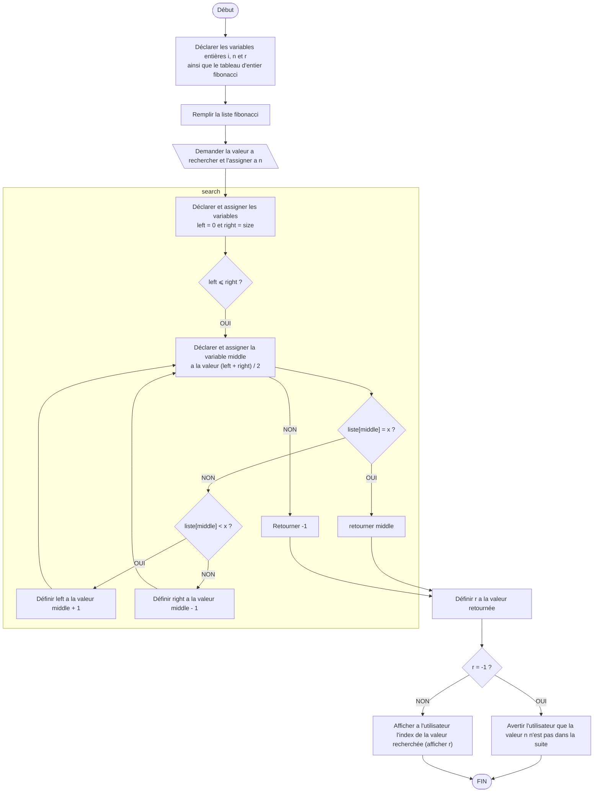

```mermaid
flowchart TD
    START(["Début"]) --> A["Déclarer les variables entières i, n et r\nainsi que le tableau d'entier fibonacci"]
    A --> B["Remplir la liste fibonacci"]
    B --> C[\"Demander la valeur a rechercher et l'assigner a n"\]
    C --> S_A
    subgraph search
        S_A["Déclarer et assigner les variables\nleft = 0 et right = size"] --> S_B{"left ⩽ right ?"}
        S_B --OUI--> S_C["Déclarer et assigner la variable middle\na la valeur (left + right) / 2"]
        S_C --> S_D{"liste[middle] = x ?"}
        S_D --OUI--> S_E["retourner middle"]
        S_D --NON--> S_F{"liste[middle] < x ?"}
        S_F --OUI--> S_G["Définir left a la valeur middle + 1"]
        S_F --NON--> S_H["Définir right a la valeur middle - 1"]
        S_G --> S_C
        S_H --> S_C
        S_C--NON-->S_I["Retourner -1"]
    end
    S_E --> D["Définir r a la valeur retournée"]
    S_I --> D
    D --> E{"r = -1 ?"}
    E --OUI--> F["Avertir l'utilisateur que la valeur n n'est pas dans la suite"]
    E --NON--> G["Afficher a l'utilisateur l'index de la valeur recherchée (afficher r)"]
    F --> END([FIN])
    G --> END

```